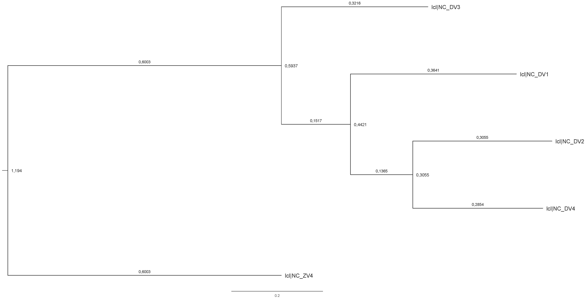

# Análisis Filogenético de Virus del Dengue y Zika
#### Gabriel Alejandro Morales Pérez (gamorales@puce.edu.ec)   27 de Junio, 2023

Este proyecto tiene como objetivo analizar las relaciones evolutivas entre distintos serotipos del virus del Dengue y el virus Zika utilizando sus secuencias genómicas completas. 
El análisis incluye la obtención de datos del NCBI, el procesamiento y alineamiento de secuencias, la construcción de árboles filogenéticos y la interpretación de los resultados.

### Flujo de Trabajo del Programa

1. **Obtención de Datos**: 
Las secuencias genómicas de los virus del Dengue (serotipos 1-4) y Zika se obtuvieron del NCBI. Los detalles de este proceso se encuentran en el archivo `data/data_README.txt`.

2. **Procesamiento de Datos**: 
Las secuencias descargadas se convirtieron de formato GenBank a FASTA y se combinaron en un solo archivo FASTA (`data/Dengue_Zika_all.fasta`). Además, se realizó un recorte de las secuencias de Dengue (`data/Dengue_all_trimmed.fasta`).

3. **Alineamiento de Secuencias**: 
Las secuencias combinadas de Dengue y Zika se alinearon utilizando Muscle (`results/Dengue_Zika_aligned.fasta`).

4. **Conversión de Formato**: 
El alineamiento se convirtió de formato FASTA a PHYLIP utilizando un script de Biopython (`results/Dengue_Zika_aligned.phy`).

5. **Construcción del Árbol Filogenético**: 
Se construyó un árbol filogenético utilizando IQ-TREE con el modelo GTR+G+I, 1000 réplicas de bootstrap ultrarrápido y 1000 réplicas de SH-aLRT (`results/Dengue_Zika_iqtree`).

6. **Visualización y Interpretación**: 
El árbol filogenético resultante se visualizó y se interpretaron las relaciones evolutivas entre los virus del Dengue y Zika.

Los detalles de los comandos utilizados en cada paso se encuentran en el archivo `scripts/scripts_README.txt`.

Árbol filogenético que muestra las relaciones evolutivas entre los virus del Dengue (serotipos 1-4) y el virus Zika.

Se pueden observar los cuatro serotipos del virus del Dengue (etiquetados como lcl|NCDV1 , lcl|NCDV2, lcl|NCDV3 y lcl|NCDV4) forman un grupo monofilético, lo que sugiere que todos ellos comparten un ancestro común más reciente. Esto es consistente con el conocimiento de que los cuatro serotipos del Dengue están estrechamente relacionados entre sí.

Dentro del clado del Dengue, los serotipos 1 y 3 (lcl|NCDV1 y lcl|NCDV3) están más estrechamente relacionados entre sí que con los otros serotipos. Esto sugiere que estos dos serotipos podrían haber divergido de un ancestro común más recientemente en comparación con los serotipos 2 y 4.

El virus Zika (etiquetado como lcl|NCZV4) se encuentra fuera del grupo del Dengue, lo que indica que está más lejanamente relacionado con los virus del Dengue que estos entre sí. Esto es consistente a que el Zika aunque está relacionado con el Dengue, es un virus distinto.

Para más información general y conceptos de Dengue así como sus serotipos: 

Para más información general y conceptos de Zika: 

### Uso del Programa

#### Dependencias
- Muscle
- IQ-TREE
- Biopython
- R packages: deldir, rgeos, PairViz, TSP, graph

#### Instrucciones de Uso
1. Clona este repositorio.
2. Asegúrate de tener todas las dependencias instaladas.
3. Ejecuta los scripts en el orden descrito en `scripts/scripts_README.txt`.

### Autor
- Gabriel Alejandro Morales Pérez
    - Estudiante de [Bioinformática - PUCE]
    - contacto: gamorales@puce.edu.ec

### Agradecimientos
- A Jorge Drexler, porque al igual que yo, nuestra casa está en las fronteras y las fronteras se mueven como las banderas.

### Referencias
- [Dengue (Internet). OPS/OMS | Organización Panamericana de la Salud. 2024. Disponible en: https://www.paho.org/es/temas/dengue]
- [OPS. Sistema de alerta y respuesta temprana ante brotes de dengue: guía operativa basada en el tablero de mandos en línea (Internet). 2021. Disponible en: https://iris.paho.org/handle/10665.2/53961]
- [World Health Organization: WHO, World Health Organization: WHO. Dengue y dengue grave (Internet). 2024. Disponible en: https://www.who.int/es/news-room/fact-sheets/detail/dengue-and-severe-dengue]

